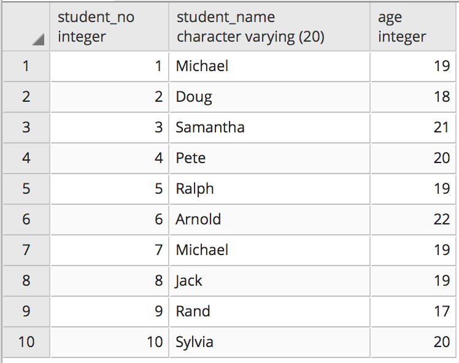
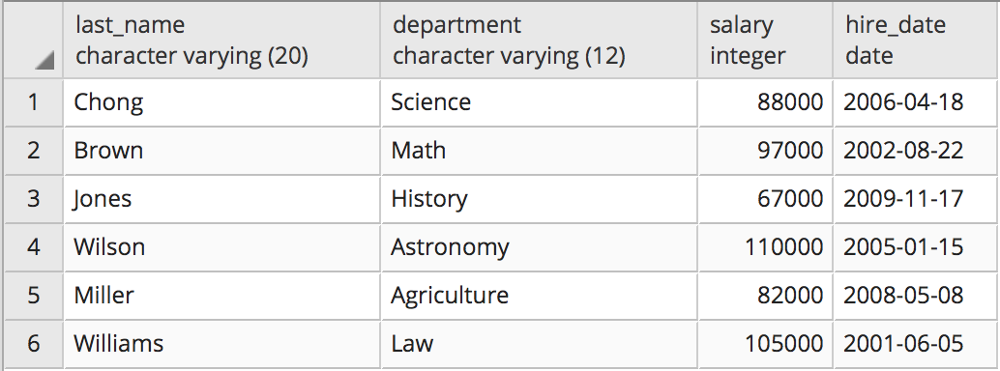
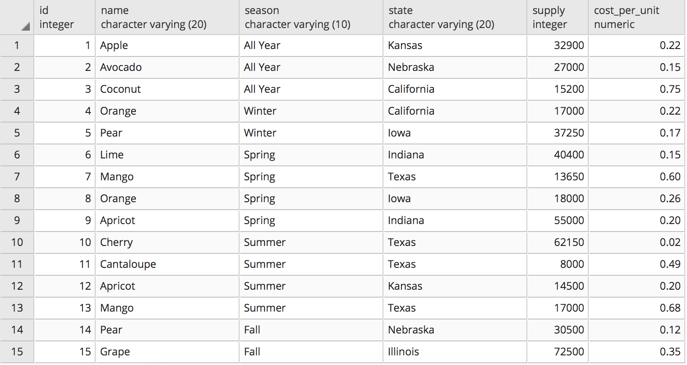
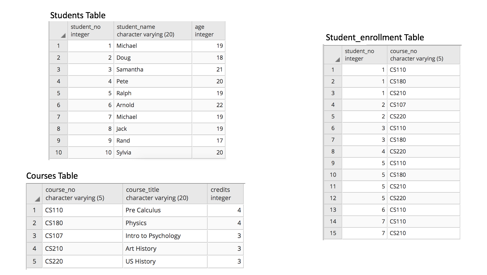

# SQL Training

## The Create & Insert Clauses

SQL basically stores data in tables, to create a new table in a database you need to do something like this

```sql
create table departments (
    department varchar(100),
    division varchar(100),
    primary key (department)
  );
```

Here we are creating a table called departments. We have two columns, one called department and the other called division, both of which are 100 character strings. We are setting the department column as the "primary key" which forces that column to have non-null and non-duplicate values.

```sql
insert into departments values ('Clothing','Home');
insert into departments values ('Grocery','Home');
insert into departments values ('Decor','Home');
insert into departments values ('Furniture','Home');
```

In the above query we insert four items into the departments table, notice how none of them repeat.

## The Select Clause

SELECT -> Basically telling the database that you want to retrieve data
\* -> A wildcard, telling database to retrieve ALL columns from a particular table

```sql
SELECT employee_id, first_name, department
FROM employees
```

In the above statement, we are retrieving the entries from the three listed columns in the employees table

```sql
SELECT *
FROM employees
```

Using the asterisk in this situation will give you all of the columns in the employees table

## The Where Clause

The Where clause filters specific records.

```sql
SELECT *
FROM employees
WHERE department = 'Sports'
```

In the above statement we are retrieving only the employees that work in the sports department. To see employees who work in other departments, you can chance the department to search in by replacing Sports.

**Note: SQL is case insensitive, the clauses can be lowercase or uppercase**

```sql
SELECT *
FROM employees
WHERE department like '%nitu%'
```

Here the like statement makes a rough match which means that any worker who works in a department with those consecutive chars will be returned. Besically checks if the string contains said word. The percentage sign is a wildcard, it matches any character(s).

```sql
SELECT *
FROM employees
WHERE department like 'F%nitu%'
```

This literally matches the char F then some substring then the substring nitu then some other substring.

```sql
SELECT *
FROM employees
WHERE salary > 100000
```

Now we basically searh for all employees where salary is greater than a hundred thousand dollars. The other comparision operators are: <, >, >=, <=, =. The where clause basically checks for true or false in the statement next to it. If the condition returned is false, the where clause ignores that entry.

```sql
SELECT *
FROM employees
WHERE department = 'Clothing'
AND salary > 90000
AND region_id = 2
```

If you want to filter based on multiple conditions, you can use the AND clause. In this situation we are looking for employees who work in the clothing department and a salary more than 90000 and region 2. You can add on more AND statements to the where clause to filter on more conditions. Al 3 conditions above must be true to return a record.

```sql
SELECT *
FROM employees
WHERE department = 'Clothing'
OR salary > 90000
```

If you want to filter on one or another condition, you can use the OR clause. In the statement above you are instructing the database to retrieve records where the employee works in clothing OR has a salary greater than 90k.

```sql
SELECT *
FROM employees
WHERE salary < 40000
AND (department = 'Clothing'
OR department = 'Pharmacy')
```

Using parenthesis causes conditions within them to be evaluated together. The above statement looks for records where the salary is greater than 90k and works in the clothing or pharmacy dept.

```sql
SELECT first_name, email
FROM employees
WHERE gender = 'F'
AND department = 'Tools'
AND salary > 110000
```

This statement gets the employees first name and email, who are female, work in tools, and have a salary greater than 110k.

```sql
SELECT first_name, hire_date
FROM employees
WHERE salary > 165000
OR (department = 'Sports' AND gender = 'M')
```

This statement gets employees first name and hire date who either make 165k or more OR are males and work in the sports department.

## Non-Equality Statements and NULL

```sql
SELECT *
FROM employees
WHERE NOT department = 'Sports'
```

By sticking the not in there, we are checking if the department is not equal to sports. We could also used the != operator. Also could use the <> less than and greater than to check if it is not equal to the given value.

```sql
SELECT *
FROM employees
WHERE email IS NULL
```

Because you can't use the = operator to determine if a certain value is null, you use the IS operator instead. In the above case you are getting all the employee records in which the email is a NULL value.

```sql
SELECT *
FROM employees
WHERE NOT email IS NULL
```

Here you are checking for records with emails that are not null. Similar to the example where we check for employees who don't work in sports.

```sql
SELECT *
FROM employees
WHERE email IS NOT NULL
```

Same as the above but now it's easier to read. Almost like the != operator.

## The IN clause

```sql
SELECT *
FROM employees
WHERE department IN ('Sports', 'First Aid', 'Toys', 'Garden')
```

In this query we look for employees who work in any one of those listed departments. Basically can be rewritten with a bunch of OR statements. The employees have to work in sports or first aid or toys or the garden, no other departments.

## The BETWEEN Operator

```sql
SELECT *
FROM employees
WHERE salary BETWEEN 80000 AND 100000
```

This literally reads like english, the between operator basically sets the boundries seperated by an AND clause. It is inclusive of the boundries. It can also be used with dates.

```sql
SELECT first_name, hire_date
FROM employees
WHERE hire_date BETWEEN '2002-1-1' AND '2004-1-1'
```

Employees who were hired between those dates.

```sql
-- This is a comment in sql
SELECT *
FROM employees
WHERE (gender = 'M' AND department = 'Automotive' AND salary BETWEEN 40000 AND 100000)
OR (gender = 'F' AND department = 'Toys')
```

Check out that comment in sql!

## ORDER BY Clause

```sql
SELECT *
FROM employees
ORDER BY employee_id
```

This clause literally does what it says. You can add the desc keyword to flip the order to make it largest to smallest. The default order is smallest to largest. You can order number or varchars or even dates. You can also chose which column to order by either with the column name or the column number.

```sql
SELECT SUBSTRING(email FROM POSITION('@' IN email)+1) as domain, COUNT(*)
FROM employees
WHERE NOT email IS NULL
GROUP BY domain
ORDER BY COUNT(*) desc
```

Here we want the domain names and the number of employees who have an email registered with the domain name. Then we ignore the NULL values and sort by the most used domain name first.

```sql
SELECT gender, region_id, MIN(salary) as min_salary, MAX(salary) as max_salary, ROUND(AVG(salary)) as avg_salary
FROM employees
GROUP BY gender, region_id
ORDER BY gender, region_id
```

Here I wanted to get the min, max and average salaries of each of the regions seperated by the gender to see the differences.

## DISTINCT Keyword

```sql
SELECT DISTINCT department
FROM employees
```

This clause basically avoids returning duplicate values. In the above query it only shows the unique departments without repeats.

## LIMIT/FETCH FIRST keyword

```sql
SELECT DISTINCT department
FROM employees
ORDER BY 1
LIMIT 10
```

Limit gets added to the end of the query and specifies how many records to return. Combined with order by, it can show the top n results of a query.

```sql
SELECT DISTINCT department
FROM employees
ORDER BY 1
FETCH FIRST 10 ROWS ONLY
```

This query is basically the same as the LIMIT keyword above, but reads easier. NOTE: you cannot do FETCH LAST instead of FETCH FIRST, if you want the last 10 results you would need to use a subquery.

## AS keyword

```sql
SELECT first_name, last_name, department, salary as "Yearly Salary"
FROM employees
```

Here the query will run and display the salary column as "Yearly Salary" in order to give the user more information. This is useful if you are exporting the table to somewhere. It can also be used to alias tables such as the employees table.

## Formatting Functions

```sql
SELECT UPPER(first_name), LOWER(department)
FROM employees
```

This query will return all the records' first name and department, but it will make the first name all uppercase and the department all lower case.

```sql
SELECT LENGTH(first_name), LOWER(department)
FROM employees
```

You can alse use the length funtion to find the length of the first names.

```sql
SELECT LENGTH(TRIM('   HELLO THERE   '))
```

The trim function gets rid of trailing spaces. You can also have functions within functions, here we will get the length of the text after it is trimmed.

## Pipes/Combining columns

```sql
SELECT first_name || ' ' || last_name as full_name
FROM employees
```

This query basically combines the first and last names and adds a space in between. The pipes are basically concatenating the two columns. you can also use the as keyword here to name your new column. To add more columns to the view you can just add more commas.

## Boolean Expressions

```sql
SELECT first_name || ' ' || last_name as full_name, (salary > 140000) as is_highly_paid
FROM employees
ORDER BY salary desc
```

This query combines the name and then creates a new column which displays true if the person's salary is greater than 140k and false if it isn't. It uses a boolean expression. Lastly it orders by salary so that the bigger salaries appear at the top.

```sql
SELECT department, ('Clothing' IN (department))
FROM employees
```

This is also a boolean expression, which checks if the current department is the clothing department or not. True if it is and false if it is not. You can also use the like key word in those parenthesis to see if the department contains any key sub strings. You can basically use any of the WHERE clause stuff in the boolean expression.

## String Functions

```sql
SELECT SUBSTRING('This is test data' FROM 1 FOR 4)
SELECT SUBSTRING('This is test data' FROM 9 FOR 4)
SELECT SUBSTRING('This is test data' FROM 9)
```

Here we are trying to extract a substring from the given sentance. We start at the 1st character and tell the substring to get the next 4 characters including the first. The second select statement is basically the same but starts at the 9th character thus extractin the word 'test'. Lastly by getting rid of the for clause we are telling sql to start at the 9th character and go till the end of the string.

```sql
SELECT department,
REPLACE(department, 'Clothing', 'Attire') modified_data,
department || ' Department' as "Complete Department Name"
FROM departments
```

The replace function takes in a string, the substring to find, and the substring to replace. Here we are extracting the department column and then creating a new column where the word clothing in the dapartment column is replaced with attire.

```sql
SELECT POSITION ('@' IN email)
FROM employees
```

The position function gets the position of the charater from a string in this case we are looking for the @ symbol in an email address.

```sql
SELECT COALESCE(email, 'NONE')
FROM employees
```

The coalesce function looks for NULL values within the record and replaces them with the string we chose, in this case we are replacing it with the string 'NONE'.

## Grouping Functions

Grouping functions take in multiple rows and output one.

- MAX()
  - Finds the maximum value of a selected columns
- MIN()
  - Finds the minimum value of a selected column
- AVG()
  - Finds the average value of a selected column
- ROUND()
  - Rounds a value to the nearest whole number
- COUNT()
  - Calculates the number of non-null values in the selected column
- SUM()
  - Sums the values in a selected column

```sql
SELECT SUM(salary)
FROM employees
WHERE department = 'Toys'
```

In this query we are combining the grouping function with a where clause to filter out the non-important departments and focus on the salaries of the workers in the toys department.

## GROUP BY and HAVING clauses

```sql
SELECT department, SUM(salary)
FROM employees
GROUP BY department
```

This query basically groups all of the department and shows the sum of every group.

```sql
SELECT COUNT(*)
FROM employees
GROUP BY department
```

Here you're just getting the number of employees in each department.

```sql
SELECT department, count(*) total_number_employees, round(AVG(salary)) avg_sal, MIN(salary) min_sal, MAX(salary) max_sal
FROM employees
GROUP BY department
ORDER BY total_number_employees desc
```

This query gets the department, count number of employees in each department, averages the salaries in each department, and finds the min and max. Then it orders it by the department with the most employees appearing first. We can even add a WHERE clause to filter more of the records. NOTE: Non-aggregate columns need to be specified in the group by clause or else your query will throw an error.

```sql
SELECT department, gender, count(*)
FROM employees
GROUP BY department, gender
ORDER BY department
```

You can group by multiple things. In this output we will have 2 rows for each department, one which tells you the males and one which tells you the females.

```sql
SELECT department
FROM employees
GROUP BY department
```

This query is just an alternative to the distinct keyword

```sql
SELECT department, count(*)
FROM employees
GROUP BY department
HAVING count(*) > 35
ORDER BY department
```

To filter based on aggregate data, you need to use the HAVING clause which will take the place of a WHERE clause.

```sql
SELECT COUNT(*), first_name
FROM employees
GROUP BY first_name
HAVING COUNT(*) > 1
ORDER BY COUNT(*) desc
```

Looking for all of the employees who have the same first name and how many of them there are.

## Aliasing Table Names

```sql
SELECT e.department
FROM employees e, departments d
```

In this query we are looking for the department field but because both tables had a department column, we would need to specify which table we are looking in.

## Subqueries

```sql
SELECT *
FROM employees
WHERE department NOT IN (SELECT department FROM departments)
```

This query has a subquery which fist gets all the departments from the departments table then takes those and compares them to te departments in the employees table.

```sql
SELECT *
FROM employees
WHERE department IN (SELECT department WHERE division = 'Electronics')
```

We want to get the employees who work in the Electronics division.

## ANY and ALL operator

```sql
SELECT * FROM employees
WHERE region_id > ALL(SELECT region_id FROM regions WHERE country = 'United States')
```

In this query we wanted to find employees from regions that were not in the United States

```sql
SELECT salary
FROM employees
GROUP BY salary
HAVING count(*) >= ALL(SELECT count(*) FROM employees
                        GROUP BY salary)
ORDER BY salary desc
LIMIT 1
```

Basically, we get all the salaries that are greater than or equal to all the occurences of the salary in the subquery.

## Conditional Expressions with CASE clause

```sql
SELECT first_name, salary,
CASE
  WHEN salary < 100000 THEN 'UNDER PAID'
  WHEN salary > 100000 AND salary < 160000 THEN 'PAID WELL'
  ELSE 'EXECUTIVE'
END
FROM employees
ORDER BY salary desc
```

This query is self explanatory. The case statement creates a new column which uses the conditions to label an employee appropriately.

```sql
SELECT SUM(CASE WHEN salary < 100000 THEN 1 ELSE 0 END) as under_paid,
SUM(CASE WHEN salary > 100000 AND salary < 150000 THEN 1 ELSE 0 END) as paid_well,
SUM (CASE WHEN salary > 150000 THEN 1 ELSE 0 END) as executive
FROM employees
```

If you wanted to transpose the table you get above, you can use the sum function to your advantage.

## Correlated Sub Queries

```sql
SELECT first_name, salary
FROM employees e1
WHERE salary > (SELECT ROUND(AVG(salary))
                FROM employees e2 WHERE e1.department = e2.department)
```

Correlated sub query is one where the sub query has access to the outer query. In the above query we are getting the employees who are making an above average salary for their **particular** department.

```sql
SELECT e1.department, e1.first_name, e1.salary, CASE WHEN e1.salary = (SELECT MAX(salary) FROM employees AS e3 WHERE e1.department = e3.department) THEN 'HIGHEST SALARY' ELSE 'LOWEST SALARY' END

FROM employees AS e1
WHERE salary IN ((SELECT MAX(salary)
                FROM employees AS e2
                WHERE e1.department = e2.department),
                (SELECT MIN(salary)
                FROM employees AS e2
                WHERE e1.department = e2.department))
ORDER BY department
```

Find the employees that make the highest and lowest salaries in each department.

```sql
SELECT hire_date, salary,
(SELECT SUM(salary)
 FROM employees as e2
 WHERE e2.hire_date BETWEEN e.hire_date - 90 AND e.hire_date) as spending_pattern
FROM employees e
ORDER BY hire_date
```

Find the amount of money spent on new salaries for 90 days after a new hire.

## Table joins

```sql
SELECT first_name, email, division
FROM employees as A, departments as B
WHERE A.department  = B.department AND email IS NOT NULL
```

In this table join we want to get the first_name, email and division of all the employees division is in the departments table.

```sql
SELECT country, COUNT(*)
FROM regions r, employees e
WHERE r.region_id = e.region_id
GROUP BY country
```

Here we have a query which returns the country as well as the total number of employees in said country.

## Inner and outer Joins

```sql
SELECT first_name, country
FROM employees INNNER JOIN regions
ON employees.region_id = regions.region_id
```

Just joins the two tables together at the regions column.

```sql
SELECT first_name, department, hire_date, country
FROM employees INNER JOIN regions
ON employees.region_id = regions.region_id
WHERE hire_date IN ((SELECT MIN(hire_date) FROM employees), (SELECT MAX(hire_date) FROM employees))
```

Gets the oldest and newest employees hired as well as their country of vocation. Could have also used Union or Union All clauses instead of the Where IN clause.

```sql
SELECT distinct employees.department, departments.department
FROM employees LEFT JOIN departments ON employees.department = departments.department
```

The left join exposes ALL of the data on the left side even if it is not present on the right side. The right join basically does the opposite, these are the two types of outer joins. Basically just prioritizes a particular side.

```sql
SELECT DISTINCT employees.department, departments.department
FROM employees LEFT JOIN departments ON employees.department = departments.department
WHERE departments.department IS NULL
```

Get only those departments which exist in the employees table and are not in the departments table.

## Union and Except Clause

```sql
SELECT DISTINCT department
FROM employees
UNION
SELECT department
FROM departments
```

Here the union clause basically stacks the columns on top of each other. There needs to be the same number of columns and the data types in the columns need to be the same. You can use the ALL keyword to not get rid of duplicates.

```sql
SELECT DISTINCT department
FROM employees
EXCEPT
SELECT DISTINCT department
FROM employees
```

The escept operator takes the first result set and removes the rows from the first which are found in the second. It basically gets the records in the first table that are not found in the second table (the non-duplicates).

```sql
SELECT employees.department, COUNT(*)
FROM employees
GROUP BY department
UNION
SELECT 'TOTAL', COUNT(*)
FROM employees
```

Here we are getting the number of employees in each department and getting the total number of employees who work at this company.

## Cross Join

```sql
SELECT *
FROM employees a CROSS JOIN departments b
```

Cross Join basically tells the query to make a cartesian product between all the records in both tables. Basically all the entries in the second table repeats for every entry in the first table.

## Views

```sql
CREATE VIEW v_employee_information
SELECT first_name, email, e.department, salary, division, region, country
FROM employees e, departments d, regions r
WHERE e.department = d.department
AND e.region_id = r.region_id
```

A view is basically a temporary table that you can save. Here we just joined our three employee related tables and saved in a view.

```sql
SELECT *
FROM (SELECT * FROM departments)
```

When you have a subquery in the from clause, another term for that is an in line view.

## Window Functions

```sql
SELECT first_name  department,
COUNT(*) OVER(PARTITION BY department)
FROM employees e2
```

This query basccally has three columns and the third contains the sum of the salaries paid in the particular department. You can also partition over other columns such as region_id where you get the number of employees working for whatever region the current employee works in.

## Framing

```sql
SELECT first_name, hire_date, salary,
SUM(salary) OVER(ORDER BY hire_date RANGE BETWEEN UNBOUNDED PRECEEDING AND CURRENT ROW) as running_total_of_salaries
FROM employees
```

This query creates a running total of the salaries. All the rows before the current row basically get added to the frame. You can also use this to get the 3 preceeding rows by replacing the unbounded clause with a number.

```sql
SELECT first_name, hire_date, salary,
SUM(salary) OVER(PARTITION BY department ORDER BY hire_date) as running_total_of_salaries
FROM employees
```

Here we combine partition the frame by the department and get the running total of the department.

## Other useful functions

- NTILE
- RANK
- FIRST_VALUE

## Lecture Practice Problems

```sql
SELECT *
FROM employees
WHERE region_id IN (SELECT region_id
  FROM regions
  WHERE country = 'Asia'
  OR country = 'Canada')
AND salary > 130000
```

Get the employees who work in either Asia or Canada and make over 130k

```sql
SELECT first_name, department, (SELECT MAX(salary) FROM employees) - salary
FROM employees
WHERE region_id IN (SELECT region_id
  FROM regions
  WHERE country = 'Asia'
  OR country = 'Canada')
```

Query that gets first name, department, and the difference in their salary and the richest person's salary. And hey have to also work in Asia or Canada.

```sql
SELECT *
FROM employees
WHERE department IN (SELECT department FROM departments WHERE division = 'Kids')
AND hire_date > ALL (SELECT hire_date FROM employees WHERE department = 'Maintanence')
```

Query that returns all of those employees that work in the kids division AND the dates at which those employees were hired is greater than all of the hire_dates of employees who work in the maintenance department.

```sql
SELECT a.salary FROM(
SELECT COUNT(salary) as occurences, salary
FROM employees
GROUP BY salary
ORDER BY occurences desc, salary desc
LIMIT 1) a
```

Find the most frequent salary. Only show the salary

```sql
SELECT a.name, b.id
FROM (SELECT DISTINCT name FROM dupes) AS a,
(SELECT min(id) as id, name FROM dupes GROUP BY name) AS b
WHERE b.name = a.name
```

Find the id and name without repeats. Get the unique names from the dupes table as well as their ids.

```sql
SELECT ROUND(AVG(salary))
FROM employees
WHERE salary NOT IN (SELECT MIN(salary) FROM employees)
                 AND salary NOT IN(SELECT MAX(salary) FROM employees)
```

Computes the average of the employees salaries but excludes the minimum and maximum values.

```sql
SELECT COUNT(a.category), a.category
FROM (SELECT first_name, salary,
CASE
  WHEN salary < 100000 THEN 'UNDER PAID'
  WHEN salary > 100000 AND salary < 160000 THEN 'PAID WELL'
  ELSE 'EXECUTIVE'
END as category
FROM employees
ORDER BY salary desc) as a
GROUP BY a.category
```

Get the counts of all the people that are paid well, under paid or are executives from the employees table.

```sql
SELECT department, COUNT(*)
FROM employees
WHERE department IN ('Sports', 'Tools', 'Clothing', 'Computers')
GROUP BY department

SELECT SUM(CASE WHEN department = 'Sports' THEN 1 ELSE 0 END) as Sports,
        SUM(CASE WHEN department = 'Tools' THEN 1 ELSE 0 END) as Tools,
        SUM(CASE WHEN department = 'Clothing' THEN 1 ELSE 0 END) as Clothing,
        SUM(CASE WHEN department = 'Computers' THEN 1 ELSE 0 END) as Computers
FROM employees
```

Example of a basic transposition.

```sql
SElECT first_name,
  (CASE WHEN a.region_id = 1 THEN (SELECT country FROM regions as b WHERE a.region_id = b.region_id) ELSE NULL END) as region_1,
    (CASE WHEN a.region_id = 2 THEN (SELECT country FROM regions as b WHERE a.region_id = b.region_id) ELSE NULL END) as region_2,
    (CASE WHEN a.region_id = 3 THEN (SELECT country FROM regions as b WHERE a.region_id = b.region_id) ELSE NULL END) as region_3,
    (CASE WHEN a.region_id = 4 THEN (SELECT country FROM regions as b WHERE a.region_id = b.region_id) ELSE NULL END) as region_4,
    (CASE WHEN a.region_id = 5 THEN (SELECT country FROM regions as b WHERE a.region_id = b.region_id) ELSE NULL END) as region_5,
    (CASE WHEN a.region_id = 6 THEN (SELECT country FROM regions as b WHERE a.region_id = b.region_id) ELSE NULL END) as region_6,
    (CASE WHEN a.region_id = 7 THEN (SELECT country FROM regions as b WHERE a.region_id = b.region_id) ELSE NULL END) as region_7
FROM employees as a
```

This one was one of those get the output questions, I'm too lazy to take a screenshot of the goal.

```sql
SELECT SUM(a.region_1) + SUM(a.region_2) + SUM(a.region_3) united_states,
SUM(a.region_4) + SUM(a.region_5) asia,
SUM(a.region_6) + SUM(a.region_7) canada
FROM (SElECT first_name,
    (CASE WHEN a.region_id = 1 THEN 1 ELSE 0 END) as region_1,
    (CASE WHEN a.region_id = 2 THEN 1 ELSE 0 END) as region_2,
    (CASE WHEN a.region_id = 3 THEN 1 ELSE 0 END) as region_3,
    (CASE WHEN a.region_id = 4 THEN 1 ELSE 0 END) as region_4,
    (CASE WHEN a.region_id = 5 THEN 1 ELSE 0 END) as region_5,
    (CASE WHEN a.region_id = 6 THEN 1 ELSE 0 END) as region_6,
    (CASE WHEN a.region_id = 7 THEN 1 ELSE 0 END) as region_7
FROM employees as a) a
```

Another one of those replicate these results question.

```sql
SELECT department, COUNT(*)
FROM employees e1
WHERE 38 < (SELECT COUNT(*)
          FROM employees e2
          WHERE e1.department = e2.department)
GROUP BY department
```

Get the departments which have more than 38 employees working in them.

## Assignments

### Assignment 2

In assignment 1, you created the various tables that will be used in the practice problems for this course. One of those tables was students. Complete the problems that follow regarding the students table.



1. Write a query to display the names of those students that are between the ages of 18 and 20.

```sql
SELECT student_name
FROM students
WHERE age BETWEEN 18 AND 20
```

2. Write a query to display all of those students that contain the letters "ch" in their name or their name ends with the letters  "nd".

```sql
SELECT *
FROM students
WHERE student_name LIKE '%ch%'
OR student_name LIKE '%nd'
```

3. Write a query to display the name of those students that have the letters "ae" or "ph" in their name and are NOT 19 years old.

```sql
SELECT student_name
FROM students
WHERE (student_name LIKE '%ae%' OR student_name LIKE '%ph%')
AND age != 19
```

4. Write a query that lists the names of students sorted by their age from largest to smallest.

```sql
SELECT student_name
FROM students
ORDER BY age DESC
```

5. Write a query that displays the names and ages of the top 4 oldest students.

```sql
SELECT student_name, age
FROM students
ORDER BY age DESC
LIMIT 4
```

6. Write a query that returns students based on the following criteria: The student must not be older than age 20 if their student_no is either between 3 and 5 or their student_no is 7. Your query should also return students older than age 20 but in that case they must have a student_no that is at least 4.

```sql
SELECT *
FROM students
WHERE (age <= 20 AND student_no BETWEEN 3 AND 5 OR student_no = 7)
OR (age > 20 AND student_no >= 4)
```

### Assignment 3



1. Write a query against the professors table that can output the following in the result: "Chong works in the Science department"

```sql
SELECT last_name || ' works in the ' || department || ' department'
FROM professors
WHERE department = 'Science'
```

2. Write a SQL query against the professors table that would return the following result: 
  "It is false that professor Chong is highly paid"
  "It is true that professor Brown is highly paid"
  "It is false that professor Jones is highly paid"
  "It is true that professor Wilson is highly paid"
  "It is false that professor Miller is highly paid"
  "It is true that professor Williams is highly paid"
  NOTE: A professor is highly paid if they make greater than 95000

```sql
SELECT 'It is ' || (salary > 95000) || ' that professor ' || last_name || ' is highly paid'
from professors
```

3. Write a query that returns all of the records and columns from the professors table but shortens the department names to only the first three characters in upper case.

```sql
SELECT *, SUBSTRING(UPPER(department) FROM 1 FOR 3) as department
FROM professors
```

4. Write a query that returns the highest and lowest salary from the professors table excluding the professor named 'Wilson'.

```sql
SELECT MAX(salary), MIN(salary)
FROM professors
WHERE last_name != 'Wilson'
```

5. Write a query that will display the hire date of the professor that has been teaching the longest.

```sql
SELECT MIN(hire_date)
FROM professors
```

### Assignment 4

On the bottom of this page, you'll find the link to a SQL script that you'll need to execute. After executing that script you'll have created the table shown below. This table is called fruit_imports and it contains data on importing various fruits from different states and things like supply and cost_per_unit. The problems that follow will involve querying this table.



Questions for this assignment:

1. Write a query that displays only the state with the largest amount of fruit supply.

```sql
SELECT state
FROM fruit_imports
ORDER BY supply desc
LIMIT 1
```

2. Write a query that returns the most expensive cost_per_unit of every season. The query should display 2 columns, the season and the cost_per_unit

```sql
SELECT season, MAX(cost_per_unit)
FROM fruit_imports
GROUP BY season
```

3. Write a query that returns the state that has more than 1 import of the same fruit.

```sql
SELECT state
FROM fruit_imports
GROUP BY state, name
HAVING COUNT(*) > 1
```

4. Write a query that returns the seasons that produce either 3 fruits or 4 fruits.

```sql
SELECT season
FROM fruit_imports
GROUP BY season
HAVING COUNT(name) = 3 OR COUNT(name) = 4
```

5. Write a query that takes into consideration the supply and cost_per_unit columns for determining the total cost and returns the most expensive state with the total cost.

```sql
SELECT state, supply*cost_per_unit as total_cost
FROM fruit_imports
ORDER BY total_cost desc
LIMIT 1
```

6. Execute the below SQL script and answer the question that follows:
CREATE table fruits (fruit_name varchar(10));
INSERT INTO fruits VALUES ('Orange');
INSERT INTO fruits VALUES ('Apple');
INSERT INTO fruits VALUES (NULL);
INSERT INTO fruits VALUES (NULL);
Write a query that returns the count of 4. You'll need to count on the column fruit_name and not use COUNT(*)
HINT: You'll need to use an additional function inside of count to make this work.

```sql
SELECT COUNT(COALESCE(fruit_name, 'NONE'))
FROM fruits
```

### Assignment 5

In this section you'll practice working with subqueries. The questions that follow are based on the tables you created in assignment one. The image displays 3 of those tables you can use to solve the problems in this section. Reviewthese tables and understand how the data is related before moving on.



Questions for this assignment

1. Is the students table directly related to the courses table? Why or why not?

```text
NO because they don't share any columns
```

2. Using subqueries only, write a SQL statement that returns the names of those students that are taking the courses  Physics and US History.
NOTE: Do not jump ahead and use joins. I want you to solve this problem using only what you've learned in this section.

```sql
SELECT DISTINCT student_name
FROM students
WHERE student_no IN (SELECT student_no
FROM student_enrollment
WHERE course_no IN (
  SELECT course_no FROM courses WHERE course_title IN ('Physics', 'US History')))
```

3. Using subqueries only, write a query that returns the name of the student that is taking the highest number of courses.
NOTE: Do not jump ahead and use joins. I want you to solve this problem using only what you've learned in this section.

```sql
SELECT b.student_name
FROM (SELECT COUNT(student_no) AS num_courses, student_no
  FROM student_enrollment
  GROUP BY student_no
  ORDER BY num_courses desc
  LIMIT 1) AS a, students AS b
WHERE a.student_no = b.student_no
```

4. Answer TRUE or FALSE for the following statement:
Subqueries can be used in the FROM clause and the WHERE clause but cannot be used in the SELECT Clause.

```text
False
```

5. Write a query to find the student that is the oldest. You are not allowed to use LIMIT or the ORDER BY clause to solve this problem.

```sql
SELECT student_name
FROM students
WHERE age >= ALL (SELECT age FROM students)
```

### Assignment 6

The image below shows the fruit_imports table you created in assignment 4. The problems that follow will be using this table.

.png)

Questions for this assignment

1. Write a query that displays 3 columns. The query should display the fruit and it's total supply along with a category of either LOW, ENOUGH or FULL. Low category means that the total supply of the fruit is less than 20,000.  The enough category means that the total supply is between 20,000 and 50,000. If the total supply is greater than 50,000 then that fruit falls in the full category.

```sql
SELECT name, supply,
  CASE
    WHEN supply < 20000 THEN 'LOW'
    WHEN supply > 20000 AND supply < 50000 THEN 'ENOUGH'
    ELSE 'FULL'
  END
FROM fruit_imports
```

2. Taking into consideration the supply column and the cost_per_unit column, you should be able to tabulate the total cost to import fruits by each season. The result will look something like this:
"Winter" "10072.50"
"Summer" "19623.00"
"All Year" "22688.00"
"Spring" "29930.00"
"Fall" "29035.00"

```sql
SELECT SUM(cost_per_unit*supply) total_cost, season
FROM fruit_imports
GROUP BY season
```

3. Write a query that would transpose this data so that the seasons become columns and the total cost for each season fills the first row?

```sql
SELECT
  SUM(CASE WHEN season = 'Winter' THEN a.total_cost ELSE 0 END) Winter,
  SUM(CASE WHEN season = 'Summer' THEN a.total_cost ELSE 0 END) Summer,
  SUM(CASE WHEN season = 'All Year' THEN a.total_cost ELSE 0 END) as "All Year",
  SUM(CASE WHEN season = 'Spring' THEN a.total_cost ELSE 0 END) Spring,
  SUM(CASE WHEN season = 'Fall' THEN a.total_cost ELSE 0 END) Fall
FROM (SELECT SUM(cost_per_unit*supply) total_cost, season
      FROM fruit_imports
      GROUP BY season) a
```

### Assignment 7

The questions that follow will be related to the tables that you created in assignment one. Query those tables and try to figure out how the data is related. Those tables are: students, courses, student_enrollment, professors, and teach. The follow problems are related to these.

Questions for this assignment

1. Are the tables student_enrollment and professors directly related to each other? Why or why not?

```txt
No they are not because they do not share a column.
```

2. Write a query that shows the student's name, the courses the student is taking and the professors that teach that course.

```sql
SELECT student_name, course_title, last_name
FROM students INNER JOIN student_enrollment ON students.student_no = student_enrollment.student_no
INNER JOIN courses ON student_enrollment.course_no = courses.course_no
INNER JOIN teach ON courses.course_no = teach.course_no
ORDER BY student_name
```

3. If you execute the query from the previous answer, you'll notice the student_name and the course_no is being repeated. Why is this happening?

```txt
It's because these are the columns that are common amongst the different tables
```

4. In question 3 you discovered why there is repeating data. How can we eliminate this redundancy? Let's say we only care to see a single professor teaching a course and we don't care for all the other professors that teach the particular course. Write a query that will accomplish this so that every record is distinct.
HINT: Using the DISTINCT keyword will not help. :-)

```sql
SELECT *
FROM students AS a, student_enrollment AS b, courses AS c, teach AS d
WHERE a.student_no = b.student_no AND b.course_no = c.course_no AND d.last_name = (SELECT last_name FROM teach AS e WHERE c.course_no = e.course_no LIMIT 1)
ORDER BY d.course_no
```

5. Why are correlated subqueries slower that non-correlated subqueries and joins?

```txt
The subquery is being run for every outer query so it's almost an exponential increase in time complexity.
```

6. In the video lectures, we've been discussing the employees table and the departments table. Considering those tables, write a query that returns employees whose salary is above average for their given department.

```sql
SELECT salary, first_name
FROM employees as e1
WHERE salary > (
  SELECT AVG(salary) FROM employees as e2 WHERE e1.department = e2.department)
```

7. Write a query that returns ALL of the students as well as any courses they may or may not be taking.

```sql
SELECT *
FROM students a CROSS JOIN courses b
```

### Assignment 8

The questions in this section will require you to use the tables you created in assignment 1. Those tables are: students, student_enrollment, courses, professors and teach. Remember all assignments are mandatory, especially assignment 1.  If you completed assignment 1, you should have these tables in your database already. If have not completed all of the previous assignments in this course, this section will not be feasible for you. Go back and complete all other problems and then come back here for a good challenge!

Questions for this assignment

1. Write a query that finds students who do not take CS180.

2. Write a query to find students who take CS110 or CS107 but not both.

3. Write a query to find students who take CS220 and no other courses.

4. Write a query that finds those students who take at most 2 courses. Your query should exclude students that don't take any courses as well as those  that take more than 2 course. 

5. Write a query to find students who are older than at most two other students.
